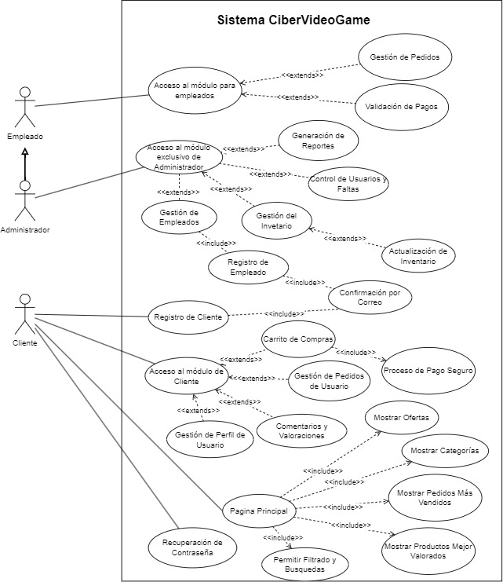

# Casos de Uso
### Alto Nivel
---

#### Pagina de Inicio
| **Mostrar Productos Más Vendidos** | |
| --- | --- |
| Tipo | Secundario |
| Actores | Cliente, Administrador |
| Descripción | Permite a los usuarios ver los productos más vendidos dentro de un período de tiempo específico.|

| **Mostrar Productos Mejor Valorados** | |
| --- | --- |
| Tipo | Secundario |
| Actores | Cliente, Administrador |
| Descripción | Permite a los usuarios ver los productos mejor valorados por otros usuarios.|

| **Mostrar Ofertas** | |
| --- | --- |
| Tipo | Secundario |
| Actores | Cliente, Administrador |
| Descripción | Permite a los usuarios ver las ofertas especiales disponibles en la tienda.|

| **Mostrar Categorías** | |
| --- | --- |
| Tipo | Secundario |
| Actores | Cliente, Administrador |
| Descripción | Permite a los usuarios ver las diferentes categorías de productos disponibles en la tienda.|

| **Permitir Filtrado y Busquedas** | |
| --- | --- |
| Tipo | Secundario |
| Actores | Cliente, Administrador |
| Descripción | Permite a los usuarios filtrar y buscar productos según criterios específicos.|

#### Inicio de Sesión
| **Acceso al módulo exclusivo para el administrador** | |
| --- | --- |
| Tipo | Secundario |
| Actores | Administrador  |
| Descripción | Permite al administrador del sistema iniciar sesión en el módulo exclusivo para realizar tareas administrativas. |
| **Acceso al módulo para empleados con permisos específicos** | |
| --- | --- |
| Tipo | Secundario |
| Actores | Empleado  |
| Descripción | Permite a los empleados iniciar sesión en el sistema con permisos específicos según su rol en el negocio. |
| **Acceso al módulo de Cliente** | |
| --- | --- |
| Tipo | Secundario |
| Actores | Cliente |
| Descripción | Permite a los clientes registrados iniciar sesión en la plataforma para acceder a sus cuentas personales. |

#### Registro de Usuarios
| **Registro de Clientes** | |
| --- | --- |
| Tipo | Secundario |
| Actores | Cliente  |
| Descripción | Permite a los clientes registrarse en la plataforma proporcionando información detallada requerida para crear una cuenta. |

| **Registro de Empleados** | |
| --- | --- |
| Tipo | Secundario |
| Actores | Administrador  |
| Descripción | Permite al administrador registrar nuevos empleados en el sistema proporcionando información detallada necesaria para la contratación. |

| **Confirmación Por Correo Electrónico** | |
| --- | --- |
| Tipo | Secundario |
| Actores | Cliente, Empleado  |
| Descripción | Envía un correo electrónico de confirmación al usuario con un enlace para verificar y activar su cuenta. |

| **Recuperación de Contraseña** | |
| --- | --- |
| Tipo | Secundario |
| Actores | Cliente, Empleado  |
| Descripción | Permite a los usuarios recuperar su contraseña en caso de olvido. |

#### Administrador
| **Gestión del Inventario** | |
| --- | --- |
| Tipo | Primario |
| Actores | Administrador  |
| Descripción | Permite al administrador supervisar y gestionar el inventario de productos disponibles en la plataforma. |

| **Generación de Reportes** | |
| --- | --- |
| Tipo | Secundario |
| Actores | Administrador  |
| Descripción | Permite al administrador generar informes detallados sobre diferentes aspectos del negocio. |

| **Control de Usuarios y Faltas** | |
| --- | --- |
| Tipo | Secundario |
| Actores | Administrador  |
| Descripción | Permite al administrador gestionar a los usuarios registrados en la plataforma y controlar cualquier falta relacionada con su comportamiento. |

<!-- | **Validación de Pagos** | |
| --- | --- |
| Tipo | Secundario |
| Actores | Administrador  |
| Descripción | Permite al administrador verificar y validar los pagos realizados por los usuarios en la plataforma. | -->

| **Gestión de Empleados** | |
| --- | --- |
| Tipo | Secundario |
| Actores | Administrador  |
| Descripción | Permite al administrador gestionar el personal empleado en el negocio. |

| **Actualización de Inventario** | |
| --- | --- |
| Tipo | Primario |
| Actores | Administrador  |
| Descripción | Permite al administrador mantener actualizado el inventario de productos. |

#### Administrador/Empleado
| **Gestión de Pedidos** | |
| --- | --- |
| Tipo | Primario |
| Actores | Empleado, Administrador  |
| Descripción | Permite tanto al administrador como a los empleados gestionar los pedidos realizados por los usuarios. |

| **Validación de Pagos** | |
| --- | --- |
| Tipo | Primario |
| Actores | Empleado, Administrador  |
| Descripción | Tanto el administrador como los empleados tienen la responsabilidad de verificar y validar los pagos realizados por los usuarios. |

#### Cliente
| **Carrito de Compras** | |
| --- | --- |
| Tipo | Secundario |
| Actores | Cliente  |
| Descripción | Permite a los usuarios agregar productos a un carrito de compras virtual, donde pueden revisar y gestionar los artículos seleccionados antes de proceder al pago. |

| **Proceso de Pago Seguro** | |
| --- | --- |
| Tipo | Primario |
| Actores | Cliente  |
| Descripción | Permite a los usuarios realizar pagos seguros por los productos seleccionados utilizando diferentes métodos de pago ofrecidos por la plataforma. |

| **Gestión de Pedidos de Usuario** | |
| --- | --- |
| Tipo | Primario |
| Actores | Cliente  |
| Descripción | Permite a los usuarios gestionar sus pedidos, incluyendo la verificación del estado de los pedidos pendientes, el seguimiento de los pedidos en tránsito y la revisión del historial de pedidos anteriores. |

| **Gestión de Perfil de Usuario** | |
| --- | --- |
| Tipo | Primario |
| Actores | Cliente  |
| Descripción | Permite a los usuarios gestionar su perfil personal en la plataforma, incluyendo la actualización de información de contacto, cambio de contraseña y visualización del historial de compras. |

| **Gestión de Comentarios Y Valoraciones** | |
| --- | --- |
| Tipo | Primario |
| Actores | Cliente  |
| Descripción | Permite a los usuarios dejar comentarios y valoraciones sobre los productos comprados o experimentados, así como ver y responder a los comentarios dejados por otros usuarios. |

# Diagrama de Casos de Uso

