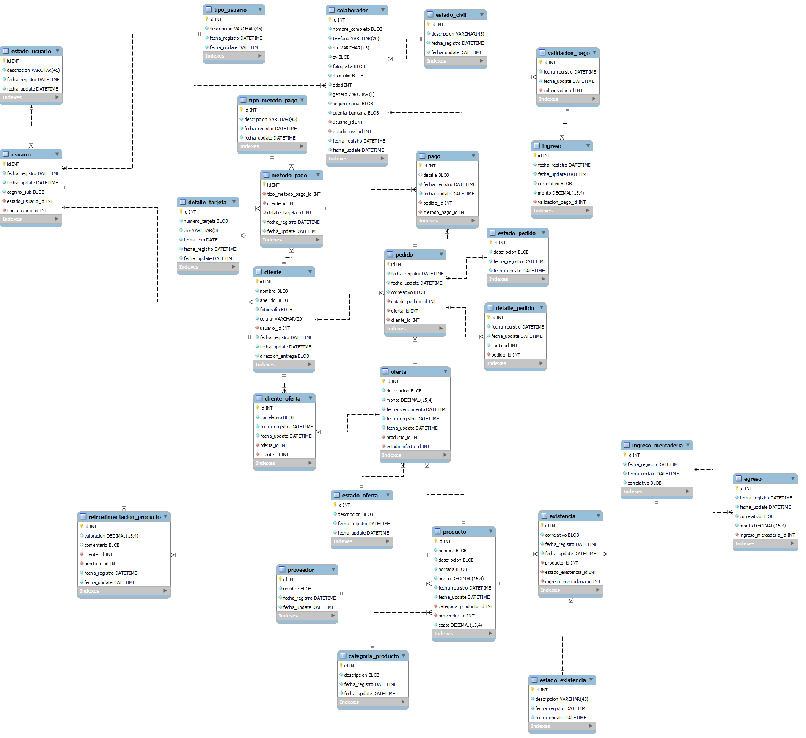
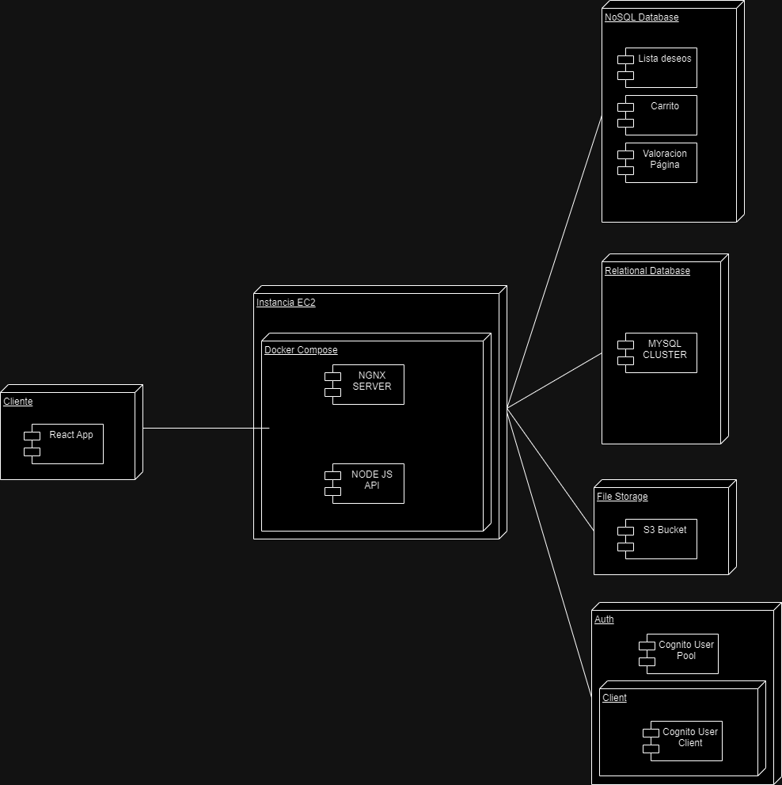

# Diagrama Entidad Relación

# Diagrama de Despliegue Arquitectonico

# Estilos arquitectonicos a utilizar

### 1. Arquitectura Orientada a Servicios (SOA)
Dado a que se implementará un backend, este será un servicio tipo rest compuesto por varios endpoints. Estos endpoints serán utilizables por varios componentes de la aplicación de Angular en el frontend. Por lo tanto, uno de los estilos arquitectonicos a utilizar será el orientado a servicios (SOA).

### 2. Arquitectura de Capas
Debido a la naturaleza de la aplicación, se puede abstraer la arquitectura en capas, estas capas se comunican entre si a través de http.

#### Backend

El servicio de backend tendrá las siguientes capas:

- Capa de autenticación (JWT y Login)
- Capa de acceso a la base de datos SQL
- Capa de acceso a las tablas NOSQL
- Capa de acceso a bucket S3
- Capa de lógica del negocio

### Frontend

El servicio de frontend tendrá las siguientes capas:

- Capa de autenticación (JWT y Login)
- Capa de acceso a backend
- Capa de lógica del negocio

### Aplicación en general

Desde un panorama general, se tendrá las siguientes capas

- Capa de autenticación
- Capa de lógica de negocio
- Capa de acceso a la información

### 3. Arquitectura Cliente-Servidor
Como se mostró en el diagrama de despliegue, otro estilo arquitectónico a implementar es el de cliente servidor, esto debido a que el cliente interactua directamente con un servidor a traves de la aplicación web.

### 4. Arquitectura de Microservicios

Como se mostró en el diagrama de despliegue, otro estilo arquitectonico a implementar es el de microservicios. Esto debido a que en el servidor, se estará orquestando 2 contenedores de docker con el uso de docker-compose. Con esto se tendrá dos microservicios:

- Frontend
- Backend

Ambos microservicios se comunicaran a traves de una docker network.

