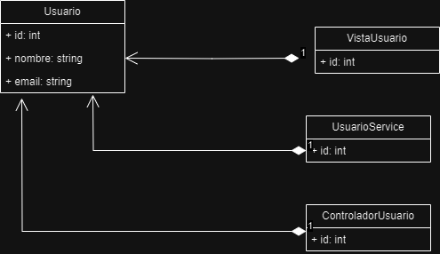
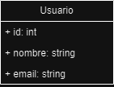
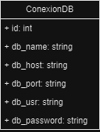

# Diagrama Entidad Relación


# Diagrama de Despliegue Arquitectonico


# Estilos arquitectonicos a utilizar

### 1. Arquitectura Orientada a Servicios (SOA)
Dado a que se implementará un backend, este será un servicio tipo rest compuesto por varios endpoints. Estos endpoints serán utilizables por varios componentes de la aplicación de Angular en el frontend. Por lo tanto, uno de los estilos arquitectonicos a utilizar será el orientado a servicios (SOA).

### 2. Arquitectura de Capas
Debido a la naturaleza de la aplicación, se puede abstraer la arquitectura en capas, estas capas se comunican entre si a través de http.

#### Backend

El servicio de backend tendrá las siguientes capas:

- Capa de autenticación (JWT y Login)
- Capa de acceso a la base de datos SQL
- Capa de acceso a las tablas NOSQL
- Capa de acceso a bucket S3
- Capa de lógica del negocio

### Frontend

El servicio de frontend tendrá las siguientes capas:

- Capa de autenticación (JWT y Login)
- Capa de acceso a backend
- Capa de lógica del negocio

### Aplicación en general

Desde un panorama general, se tendrá las siguientes capas

- Capa de autenticación
- Capa de lógica de negocio
- Capa de acceso a la información

### 3. Arquitectura Cliente-Servidor
Como se mostró en el diagrama de despliegue, otro estilo arquitectónico a implementar es el de cliente servidor, esto debido a que el cliente interactua directamente con un servidor a traves de la aplicación web.

### 4. Arquitectura de Microservicios

Como se mostró en el diagrama de despliegue, otro estilo arquitectonico a implementar es el de microservicios. Esto debido a que en el servidor, se estará orquestando 2 contenedores de docker con el uso de docker-compose. Con esto se tendrá dos microservicios:

- Frontend
- Backend

Ambos microservicios se comunicaran a traves de una docker network.


# Patrones de diseño

### 1. Patrón MVC (Modelo-Vista-Controlador)

Este patrón es fundamental para separar las preocupaciones en una aplicación web. En este caso, dado que se está desarrollando tanto un frontend como un backend, MVC proporcionaría una clara separación entre la lógica de negocios, la presentación de datos y la interacción del usuario. Esto facilita la mantenibilidad del código, ya que cada componente se puede desarrollar y probar de forma independiente. Además, permite la reutilización de código, ya que los modelos y controladores pueden ser compartidos entre diferentes vistas.

```java
// Modelo Typescript
class Usuario {
   private id: number;
   private nombre: string;
   private email: string;

   constructor(id: number, nombre: string, email: string) {
       this.id = id;
       this.nombre = nombre;
       this.email = email;
   }

   // Getters y setters
   getId(): number {
       return this.id;
   }

   setId(id: number): void {
       this.id = id;
   }

   getNombre(): string {
       return this.nombre;
   }

   setNombre(nombre: string): void {
       this.nombre = nombre;
   }

   getEmail(): string {
       return this.email;
   }

   setEmail(email: string): void {
       this.email = email;
   }
}

// Vista
class VistaUsuario {
   mostrarUsuario(usuario: Usuario): void {
       // Lógica para mostrar la información del usuario en la interfaz de usuario
       console.log(`ID: ${usuario.getId()}, Nombre: ${usuario.getNombre()}, Email: ${usuario.getEmail()}`);
   }
}

// Servicio
class UsuarioService {
   obtenerUsuarioPorId(userId: number): Usuario {
       // Aquí iría la lógica para obtener el usuario por su ID
       // Por ahora, creamos un usuario de ejemplo
       return new Usuario(userId, "Ejemplo", "ejemplo@example.com");
   }
}

// Controlador
class ControladorUsuario {
   private usuarioService: UsuarioService;

   constructor() {
       this.usuarioService = new UsuarioService();
   }

   mostrarUsuario(userId: number): void {
       const usuario = this.usuarioService.obtenerUsuarioPorId(userId);
       const vista = new VistaUsuario();
       vista.mostrarUsuario(usuario);
   }
}

```



### 2. Patrón DAO (Data Access Object)

Este patrón es útil para encapsular la lógica de acceso a la base de datos. Al separar el acceso a los datos de la lógica de negocios, se mejora la modularidad y la reutilización del código.

```java
// DAO typescript  y typescript

class Usuario {
    private id: number;
    private nombre: string;
    private email: string;

    constructor(id: number, nombre: string, email: string) {
        this.id = id;
        this.nombre = nombre;
        this.email = email;
    }

    // Getters y setters
    getId(): number {
        return this.id;
    }

    setId(id: number): void {
        this.id = id;
    }

    getNombre(): string {
        return this.nombre;
    }

    setNombre(nombre: string): void {
        this.nombre = nombre;
    }

    getEmail(): string {
        return this.email;
    }

    setEmail(email: string): void {
        this.email = email;
    }
}

class UsuarioDAO {
    obtenerUsuarioPorId(userId: number): Usuario {
        // Lógica para interactuar con la base de datos y obtener un usuario por su ID
        const usuario: Usuario = new Usuario(userId, "Ejemplo", "ejemplo@example.com");
        return usuario;
    }
}


`````


### 3. Patrón DTO (Data Transfer Object)

Este patrón es útil para transferir datos entre el frontend y el backend. Los DTOs encapsulan los datos que se envían entre los distintos componentes de la aplicación, lo que facilita la comunicación y reduce la dependencia entre los sistemas.

```java
// DTO typescript y typescript

class UsuarioDTO {
    private _id: number;
    private _nombre: string;
    private _email: string;

    constructor(id: number, nombre: string, email: string) {
        this._id = id;
        this._nombre = nombre;
        this._email = email;
    }

    get id(): number {
        return this._id;
    }

    set id(id: number) {
        this._id = id;
    }

    get nombre(): string {
        return this._nombre;
    }

    set nombre(nombre: string) {
        this._nombre = nombre;
    }

    get email(): string {
        return this._email;
    }

    set email(email: string) {
        this._email = email;
    }
}


````


### 4. Patrón Singleton

Este patrón es útil para garantizar que solo exista una instancia de una clase en todo el sistema. En este caso, podría aplicarse a componentes como el gestor de conexiones a la base de datos o el gestor de sesiones de usuario.

```java
//typescript
public class ConexionBD {
   private static ConexionBD instancia;
   private ConexionBD() {
       // Inicialización de la conexión a la base de datos
   }
   public static ConexionBD getInstance() {
       if (instancia == null) {
           instancia = new ConexionBD();
       }
       return instancia;
   }
   // Métodos para interactuar con la base de datos
}


//javascript

class ConexionBD {
   constructor() {
       // Inicialización de la conexión a la base de datos
   }

   static getInstance() {
       if (!ConexionBD.instancia) {
           ConexionBD.instancia = new ConexionBD();
       }
       return ConexionBD.instancia;
   }

   // Métodos para interactuar con la base de datos
}
ConexionBD.instancia = null;

`````


# Casos de Uso
### Alto Nivel
---

#### Pagina de Inicio
| **Mostrar Productos Más Vendidos** | |
| --- | --- |
| Tipo | Secundario |
| Actores | Cliente, Administrador |
| Descripción | Permite a los usuarios ver los productos más vendidos dentro de un período de tiempo específico.|

| **Mostrar Productos Mejor Valorados** | |
| --- | --- |
| Tipo | Secundario |
| Actores | Cliente, Administrador |
| Descripción | Permite a los usuarios ver los productos mejor valorados por otros usuarios.|

| **Mostrar Ofertas** | |
| --- | --- |
| Tipo | Secundario |
| Actores | Cliente, Administrador |
| Descripción | Permite a los usuarios ver las ofertas especiales disponibles en la tienda.|

| **Mostrar Categorías** | |
| --- | --- |
| Tipo | Secundario |
| Actores | Cliente, Administrador |
| Descripción | Permite a los usuarios ver las diferentes categorías de productos disponibles en la tienda.|

| **Permitir Filtrado y Busquedas** | |
| --- | --- |
| Tipo | Secundario |
| Actores | Cliente, Administrador |
| Descripción | Permite a los usuarios filtrar y buscar productos según criterios específicos.|

#### Inicio de Sesión
| **Acceso al módulo exclusivo para el administrador** | |
| --- | --- |
| Tipo | Secundario |
| Actores | Administrador  |
| Descripción | Permite al administrador del sistema iniciar sesión en el módulo exclusivo para realizar tareas administrativas. |
| **Acceso al módulo para empleados con permisos específicos** | |
| --- | --- |
| Tipo | Secundario |
| Actores | Empleado  |
| Descripción | Permite a los empleados iniciar sesión en el sistema con permisos específicos según su rol en el negocio. |
| **Acceso al módulo de Cliente** | |
| --- | --- |
| Tipo | Secundario |
| Actores | Cliente |
| Descripción | Permite a los clientes registrados iniciar sesión en la plataforma para acceder a sus cuentas personales. |

#### Registro de Usuarios
| **Registro de Clientes** | |
| --- | --- |
| Tipo | Secundario |
| Actores | Cliente  |
| Descripción | Permite a los clientes registrarse en la plataforma proporcionando información detallada requerida para crear una cuenta. |

| **Registro de Empleados** | |
| --- | --- |
| Tipo | Secundario |
| Actores | Administrador  |
| Descripción | Permite al administrador registrar nuevos empleados en el sistema proporcionando información detallada necesaria para la contratación. |

| **Confirmación Por Correo Electrónico** | |
| --- | --- |
| Tipo | Secundario |
| Actores | Cliente, Empleado  |
| Descripción | Envía un correo electrónico de confirmación al usuario con un enlace para verificar y activar su cuenta. |

| **Recuperación de Contraseña** | |
| --- | --- |
| Tipo | Secundario |
| Actores | Cliente, Empleado  |
| Descripción | Permite a los usuarios recuperar su contraseña en caso de olvido. |

#### Administrador
| **Gestión del Inventario** | |
| --- | --- |
| Tipo | Primario |
| Actores | Administrador  |
| Descripción | Permite al administrador supervisar y gestionar el inventario de productos disponibles en la plataforma. |

| **Generación de Reportes** | |
| --- | --- |
| Tipo | Secundario |
| Actores | Administrador  |
| Descripción | Permite al administrador generar informes detallados sobre diferentes aspectos del negocio. |

| **Control de Usuarios y Faltas** | |
| --- | --- |
| Tipo | Secundario |
| Actores | Administrador  |
| Descripción | Permite al administrador gestionar a los usuarios registrados en la plataforma y controlar cualquier falta relacionada con su comportamiento. |

<!-- | **Validación de Pagos** | |
| --- | --- |
| Tipo | Secundario |
| Actores | Administrador  |
| Descripción | Permite al administrador verificar y validar los pagos realizados por los usuarios en la plataforma. | -->

| **Gestión de Empleados** | |
| --- | --- |
| Tipo | Secundario |
| Actores | Administrador  |
| Descripción | Permite al administrador gestionar el personal empleado en el negocio. |

| **Actualización de Inventario** | |
| --- | --- |
| Tipo | Primario |
| Actores | Administrador  |
| Descripción | Permite al administrador mantener actualizado el inventario de productos. |


#### Administrador/Empleado
| **Gestión de Pedidos** | |
| --- | --- |
| Tipo | Primario |
| Actores | Empleado, Administrador  |
| Descripción | Permite tanto al administrador como a los empleados gestionar los pedidos realizados por los usuarios. |

| **Validación de Pagos** | |
| --- | --- |
| Tipo | Primario |
| Actores | Empleado, Administrador  |
| Descripción | Tanto el administrador como los empleados tienen la responsabilidad de verificar y validar los pagos realizados por los usuarios. |


#### Cliente
| **Carrito de Compras** | |
| --- | --- |
| Tipo | Secundario |
| Actores | Cliente  |
| Descripción | Permite a los usuarios agregar productos a un carrito de compras virtual, donde pueden revisar y gestionar los artículos seleccionados antes de proceder al pago. |

| **Proceso de Pago Seguro** | |
| --- | --- |
| Tipo | Primario |
| Actores | Cliente  |
| Descripción | Permite a los usuarios realizar pagos seguros por los productos seleccionados utilizando diferentes métodos de pago ofrecidos por la plataforma. |

| **Gestión de Pedidos de Usuario** | |
| --- | --- |
| Tipo | Primario |
| Actores | Cliente  |
| Descripción | Permite a los usuarios gestionar sus pedidos, incluyendo la verificación del estado de los pedidos pendientes, el seguimiento de los pedidos en tránsito y la revisión del historial de pedidos anteriores. |

| **Gestión de Perfil de Usuario** | |
| --- | --- |
| Tipo | Primario |
| Actores | Cliente  |
| Descripción | Permite a los usuarios gestionar su perfil personal en la plataforma, incluyendo la actualización de información de contacto, cambio de contraseña y visualización del historial de compras. |

| **Gestión de Comentarios Y Valoraciones** | |
| --- | --- |
| Tipo | Primario |
| Actores | Cliente  |
| Descripción | Permite a los usuarios dejar comentarios y valoraciones sobre los productos comprados o experimentados, así como ver y responder a los comentarios dejados por otros usuarios. |


# Diagrama de Casos de Uso


# Casos de uso expandidos

## Caso de Uso: Mostrar Productos Más Vendidos

### Tipo
Secundario

### Actores
Cliente, Administrador

### Descripción
Este caso de uso permite a los usuarios, tanto clientes como administradores, ver los productos más vendidos dentro de un período de tiempo específico. Esto les proporciona información sobre los productos más populares en el sistema durante ese intervalo de tiempo, lo que puede ayudar a los clientes a tomar decisiones de compra informadas y a los administradores a evaluar la demanda de ciertos productos.

### Flujo Expandido

1. **Inicio**
   - El usuario accede a la sección de "Productos Más Vendidos" en la interfaz de usuario.

2. **Seleccionar Período de Tiempo**
   - El sistema presenta al usuario la opción de seleccionar el período de tiempo para el cual desea ver los productos más vendidos.
   - El usuario elige un período de tiempo específico (por ejemplo, últimos 30 días, últimos 6 meses, último año, etc.).

3. **Recuperar Datos de Productos**
   - El sistema accede a la base de datos y recupera la información sobre las ventas de cada producto durante el período de tiempo especificado.

4. **Clasificar Productos**
   - El sistema clasifica los productos según el número de unidades vendidas durante el período seleccionado, de mayor a menor.

5. **Mostrar Productos Más Vendidos**
   - El sistema muestra al usuario la lista de productos, ordenados de acuerdo a su popularidad en ventas durante el período seleccionado.
   - Para cada producto, se muestra su nombre, imagen (si está disponible), cantidad vendida y posiblemente otras estadísticas relevantes.

6. **Fin**
   - El usuario puede revisar los productos más vendidos y tomar decisiones de compra basadas en esta información.
   - El sistema registra la actividad del usuario y retorna a la interfaz de usuario principal.

## Caso de Uso: Mostrar Productos Mejor Valorados

### Tipo
Secundario

### Actores
Cliente, Administrador

### Descripción
Este caso de uso permite a los usuarios, tanto clientes como administradores, ver los productos mejor valorados por otros usuarios. Proporciona una forma de evaluar la calidad y popularidad de los productos basados en las opiniones y calificaciones de los clientes. 

### Flujo Expandido

1. **Inicio**
   - El usuario accede a la sección de "Productos Mejor Valorados" en la interfaz de usuario.

2. **Recuperar Datos de Productos**
   - El sistema accede a la base de datos y recupera la información sobre los productos junto con sus respectivas calificaciones y opiniones de los clientes.

3. **Clasificar Productos**
   - El sistema clasifica los productos según sus valoraciones, colocando los mejor valorados en la parte superior de la lista.

4. **Mostrar Productos Mejor Valorados**
   - El sistema muestra al usuario la lista de productos, ordenados de acuerdo a sus calificaciones de mayor a menor.
   - Para cada producto, se muestra su nombre, imagen (si está disponible), calificación promedio y posiblemente algunas opiniones destacadas.

5. **Interacción Adicional (Opcional)**
   - El usuario puede seleccionar un producto específico para ver más detalles o realizar acciones adicionales, como agregarlo al carrito de compras o dejar su propia calificación y opinión.

6. **Fin**
   - El usuario puede revisar los productos mejor valorados y tomar decisiones de compra basadas en esta información.
   - El sistema registra la actividad del usuario y retorna a la interfaz de usuario principal.

## Caso de Uso: Mostrar Ofertas

### Tipo
Secundario

### Actores
Cliente, Administrador

### Descripción
Este caso de uso permite a los usuarios, tanto clientes como administradores, ver las ofertas especiales disponibles en la tienda. Proporciona una forma rápida y conveniente de acceder a información sobre descuentos, promociones u otras ofertas que pueden ser relevantes para los usuarios.

### Flujo Expandido

1. **Inicio**
   - El usuario accede a la sección de "Ofertas" en la interfaz de usuario.

2. **Recuperar Datos de Ofertas**
   - El sistema accede a la base de datos y recupera la información sobre las ofertas especiales disponibles en la tienda.

3. **Mostrar Ofertas**
   - El sistema muestra al usuario la lista de ofertas disponibles.
   - Cada oferta se presenta con detalles relevantes, como el producto o servicio asociado, el descuento aplicado, la fecha de validez, y cualquier otra información importante.

4. **Interacción Adicional (Opcional)**
   - El usuario puede seleccionar una oferta específica para ver más detalles o realizar acciones adicionales, como agregar el producto al carrito de compras.

5. **Fin**
   - El usuario puede revisar las ofertas disponibles y tomar decisiones de compra basadas en esta información.
   - El sistema registra la actividad del usuario y retorna a la interfaz de usuario principal.

## Caso de Uso: Mostrar Categorías

### Tipo
Secundario

### Actores
Cliente, Administrador

### Descripción
Este caso de uso permite a los usuarios, tanto clientes como administradores, ver las diferentes categorías de productos disponibles en la tienda. Proporciona una forma organizada de explorar la variedad de productos ofrecidos por la tienda, facilitando la búsqueda y navegación para los usuarios.

### Flujo Expandido

1. **Inicio**
   - El usuario accede a la sección de "Categorías" en la interfaz de usuario.

2. **Recuperar Datos de Categorías**
   - El sistema accede a la base de datos y recupera la información sobre las diferentes categorías de productos disponibles en la tienda.

3. **Mostrar Categorías**
   - El sistema muestra al usuario la lista de categorías disponibles.
   - Cada categoría se presenta con su nombre y posiblemente una imagen representativa.

4. **Interacción Adicional (Opcional)**
   - El usuario puede seleccionar una categoría específica para ver los productos asociados a esa categoría o para refinar su búsqueda.

5. **Fin**
   - El usuario puede explorar las diferentes categorías de productos y navegar hacia productos de su interés.
   - El sistema registra la actividad del usuario y retorna a la interfaz de usuario principal.

## Caso de Uso: Permitir Filtrado y Búsquedas

### Tipo
Secundario

### Actores
Cliente, Administrador

### Descripción
Este caso de uso permite a los usuarios, tanto clientes como administradores, filtrar y buscar productos según criterios específicos. Proporciona una funcionalidad clave para mejorar la experiencia de navegación y búsqueda de productos dentro de la tienda en línea.

### Flujo Expandido

1. **Inicio**
   - El usuario accede a la sección de búsqueda o filtrado en la interfaz de usuario.

2. **Filtrar Productos**
   - El sistema proporciona opciones de filtrado para que el usuario pueda refinar su búsqueda.
   - Los filtros pueden incluir categoría, precio, marca, tamaño, color, etc.
   - El usuario selecciona los criterios de filtrado deseados.

3. **Aplicar Filtros**
   - El sistema aplica los filtros seleccionados a la lista de productos disponibles.
   - Se muestra una lista actualizada de productos que coinciden con los criterios de filtrado.

4. **Buscar Productos**
   - El usuario tiene la opción de realizar una búsqueda de texto libre para encontrar productos específicos.
   - Ingresa palabras clave o términos relacionados con los productos que está buscando.

5. **Mostrar Resultados de Búsqueda**
   - El sistema muestra los productos que coinciden con los términos de búsqueda proporcionados por el usuario.
   - Se presentan los resultados de búsqueda de forma ordenada y relevante.

6. **Interacción Adicional (Opcional)**
   - El usuario puede ajustar los criterios de filtrado o refinar su búsqueda según sea necesario.
   - Puede ordenar los resultados según diferentes criterios, como relevancia, precio, calificación, etc.

7. **Fin**
   - El usuario puede explorar los productos filtrados o los resultados de búsqueda y tomar decisiones de compra basadas en esta información.
   - El sistema registra la actividad del usuario y retorna a la interfaz de usuario principal.

## Caso de Uso: Acceso al Módulo Exclusivo para el Administrador

### Tipo
Secundario

### Actores
Administrador

### Descripción
Este caso de uso permite al administrador del sistema iniciar sesión en el módulo exclusivo para realizar tareas administrativas. Proporciona acceso restringido a funciones y herramientas específicas diseñadas para la gestión y administración del sistema.

### Flujo Expandido

1. **Inicio de Sesión**
   - El administrador accede a la página de inicio de sesión del sistema.

2. **Autenticación**
   - El administrador ingresa su nombre de usuario y contraseña en los campos de inicio de sesión.
   - El sistema valida las credenciales del administrador.

3. **Acceso al Módulo Exclusivo**
   - Una vez autenticado, el sistema redirige al administrador al módulo exclusivo para administradores.
   - Aquí, el administrador tiene acceso a funciones y herramientas específicas para realizar tareas administrativas, como gestionar usuarios, configurar permisos, supervisar el sistema, entre otras.

4. **Fin**
   - El administrador puede realizar las tareas administrativas necesarias en el sistema.
   - Después de completar las tareas, el administrador puede cerrar sesión en el módulo exclusivo.
   - El sistema registra la actividad del administrador y lo redirige a la página principal o de inicio de sesión.


## Caso de Uso: Acceso al Módulo para Empleados con Permisos Específicos

### Tipo
Secundario

### Actores
Empleado

### Descripción
Este caso de uso permite a los empleados iniciar sesión en el sistema con permisos específicos según su rol en el negocio. Proporciona acceso restringido a funciones y herramientas diseñadas para las responsabilidades y tareas asignadas a cada empleado según su cargo o función en la organización.

### Flujo Expandido

1. **Inicio de Sesión**
   - El empleado accede a la página de inicio de sesión del sistema.

2. **Autenticación**
   - El empleado ingresa su nombre de usuario y contraseña en los campos de inicio de sesión.
   - El sistema valida las credenciales del empleado.

3. **Acceso al Módulo**
   - Una vez autenticado, el sistema redirige al empleado al módulo correspondiente según sus permisos específicos.
   - Aquí, el empleado tiene acceso a funciones y herramientas relacionadas con sus responsabilidades y tareas asignadas, como gestión de inventario, atención al cliente, procesamiento de pedidos, entre otros.

4. **Fin**
   - El empleado puede realizar las tareas asignadas según sus permisos específicos.
   - Después de completar las tareas, el empleado puede cerrar sesión en el sistema.
   - El sistema registra la actividad del empleado y lo redirige a la página principal o de inicio de sesión.


## Caso de Uso: Acceso al Módulo de Cliente

### Tipo
Secundario

### Actores
Cliente

### Descripción
Este caso de uso permite a los clientes registrados iniciar sesión en la plataforma para acceder a sus cuentas personales. Proporciona acceso personalizado a funciones y herramientas diseñadas para mejorar la experiencia del cliente, como ver el historial de compras, administrar información personal, realizar pedidos, entre otros.

### Flujo Expandido

1. **Inicio de Sesión**
   - El cliente accede a la página de inicio de sesión en la plataforma.

2. **Autenticación**
   - El cliente ingresa su nombre de usuario y contraseña en los campos de inicio de sesión.
   - El sistema valida las credenciales del cliente.

3. **Acceso al Módulo de Cliente**
   - Una vez autenticado, el sistema redirige al cliente al módulo de cliente.
   - Aquí, el cliente tiene acceso a su cuenta personalizada, donde puede realizar una variedad de acciones, como ver el historial de compras, actualizar la información de la cuenta, realizar pedidos, entre otros.

4. **Fin**
   - El cliente puede realizar las acciones deseadas dentro de su cuenta personal.
   - Después de completar las actividades, el cliente puede cerrar sesión en la plataforma si lo desea.
   - El sistema registra la actividad del cliente y lo redirige a la página principal o de inicio de sesión.

## Registro de Clientes

### Tipo
Secundario

### Actores
Cliente

### Descripción
Este caso de uso permite a los clientes registrarse en la plataforma proporcionando información detallada requerida para crear una cuenta. Facilita el proceso de incorporación de nuevos usuarios a la plataforma, permitiéndoles acceder a funciones adicionales y personalizadas.

### Flujo Expandido

1. **Inicio del Registro**
   - El cliente accede a la página de registro en la plataforma.

2. **Proporcionar Información**
   - El cliente completa el formulario de registro proporcionando información personal, como nombre, dirección de correo electrónico, contraseña, etc.

3. **Validación de Información**
   - El sistema valida la información proporcionada por el cliente, verificando que cumpla con los requisitos de formato y que no haya duplicados en la base de datos.

4. **Creación de Cuenta**
   - Si la información es válida, el sistema crea una cuenta para el cliente en la plataforma.

5. **Enviar Confirmación por Correo Electrónico (Opcional)**
   - Opcionalmente, el sistema puede enviar un correo electrónico de confirmación al cliente con un enlace para verificar y activar su cuenta.

6. **Fin**
   - El cliente ha completado el registro y puede acceder a su cuenta en la plataforma.

---

## Registro de Empleados

### Tipo
Secundario

### Actores
Administrador

### Descripción
Este caso de uso permite al administrador registrar nuevos empleados en el sistema proporcionando información detallada necesaria para la contratación. Facilita el proceso de incorporación de nuevos miembros al equipo, permitiendo al administrador gestionar eficientemente la fuerza laboral de la organización.

### Flujo Expandido

1. **Inicio del Registro**
   - El administrador accede a la sección de registro de empleados en la plataforma.

2. **Proporcionar Información**
   - El administrador completa el formulario de registro proporcionando información sobre el nuevo empleado, como nombre, dirección de correo electrónico, cargo, salario, etc.

3. **Validación de Información**
   - El sistema valida la información proporcionada por el administrador, asegurándose de que se cumplan los requisitos de formato y que no haya duplicados en la base de datos.

4. **Creación de Cuenta de Empleado**
   - Si la información es válida, el sistema crea una cuenta para el nuevo empleado en el sistema.

5. **Asignar Permisos y Roles (Opcional)**
   - Opcionalmente, el administrador puede asignar permisos y roles específicos al nuevo empleado dentro del sistema, según sus responsabilidades laborales.

6. **Fin**
   - El administrador ha completado el registro del nuevo empleado en el sistema.

---

## Confirmación Por Correo Electrónico

### Tipo
Secundario

### Actores
Cliente, Empleado

### Descripción
Este caso de uso envía un correo electrónico de confirmación al usuario con un enlace para verificar y activar su cuenta. Proporciona una capa adicional de seguridad y garantiza que las cuentas registradas estén asociadas a direcciones de correo electrónico válidas y verificadas.

### Flujo Expandido

1. **Generar Correo Electrónico de Confirmación**
   - Después de que un usuario se registre en la plataforma, el sistema genera un correo electrónico de confirmación.

2. **Enviar Correo Electrónico**
   - El sistema envía el correo electrónico de confirmación al usuario registrado, que contiene un enlace para verificar y activar su cuenta.

3. **Recepción y Verificación**
   - El usuario recibe el correo electrónico de confirmación y hace clic en el enlace proporcionado.

4. **Activación de la Cuenta**
   - Al hacer clic en el enlace de confirmación, la cuenta del usuario se activa en la plataforma.

5. **Fin**
   - El usuario ha completado el proceso de confirmación por correo electrónico y su cuenta está activa y lista para usar.

---

## Recuperación de Contraseña

### Tipo
Secundario

### Actores
Cliente, Empleado

### Descripción
Este caso de uso permite a los usuarios recuperar su contraseña en caso de olvido. Proporciona una forma segura y conveniente para restablecer la contraseña y acceder nuevamente a la cuenta.

### Flujo Expandido

1. **Solicitud de Recuperación de Contraseña**
   - El usuario accede a la página de recuperación de contraseña e indica que ha olvidado su contraseña.

2. **Proporcionar Información de Identificación**
   - El usuario proporciona la información de identificación necesaria, como dirección de correo electrónico o nombre de usuario.

3. **Validación de Información**
   - El sistema valida la información proporcionada por el usuario, asegurándose de que coincida con los registros en la base de datos.

4. **Generación de Nueva Contraseña (Opcional)**
   - Una vez validada la información, el sistema genera una nueva contraseña temporal o proporciona un enlace para restablecer la contraseña.

5. **Enviar Instrucciones por Correo Electrónico (Opcional)**
   - Opcionalmente, el sistema puede enviar instrucciones por correo electrónico al usuario para restablecer su contraseña.

6. **Restablecimiento de Contraseña**
   - El usuario sigue las instrucciones proporcionadas para restablecer su contraseña.

7. **Fin**
   - El usuario ha completado el proceso de recuperación de contraseña y puede acceder nuevamente a su cuenta con la nueva contraseña.

## Gestión del Inventario

### Tipo
Primario

### Actores
Administrador

### Descripción
Este caso de uso permite al administrador supervisar y gestionar el inventario de productos disponibles en la plataforma. Facilita el seguimiento de la disponibilidad de productos, la gestión de niveles de stock, la incorporación de nuevos productos y la eliminación de productos obsoletos.

### Flujo Expandido

1. **Supervisión del Inventario**
   - El administrador accede al sistema de gestión del inventario en la plataforma.

2. **Visualización de Productos**
   - El administrador visualiza la lista de productos disponibles en el inventario, incluyendo detalles como nombre, cantidad en stock, precios, etc.

3. **Gestión de Niveles de Stock**
   - El administrador realiza ajustes en los niveles de stock según sea necesario, realizando acciones como agregar nuevos productos al inventario, actualizar cantidades disponibles o eliminar productos obsoletos.

4. **Incorporación de Nuevos Productos**
   - En caso de nuevos productos, el administrador registra la información correspondiente en el sistema, incluyendo detalles como nombre, descripción, precio, proveedor, etc.

5. **Eliminación de Productos Obsoletos**
   - El administrador identifica y elimina productos obsoletos o que ya no se comercializan, actualizando el inventario en consecuencia.

6. **Registro de Movimientos**
   - El sistema registra cualquier cambio realizado en el inventario, incluyendo adiciones, modificaciones o eliminaciones de productos.

7. **Fin**
   - El administrador ha completado las tareas de gestión del inventario y cierra sesión en el sistema.

---

## Generación de Reportes

### Tipo
Secundario

### Actores
Administrador

### Descripción
Este caso de uso permite al administrador generar informes detallados sobre diferentes aspectos del negocio. Proporciona herramientas para analizar y evaluar el rendimiento, las ventas, las tendencias del mercado y otros aspectos relevantes para la toma de decisiones estratégicas.

### Flujo Expandido

1. **Selección de Parámetros**
   - El administrador selecciona los parámetros y criterios para el informe que desea generar, como período de tiempo, tipo de datos a incluir, etc.

2. **Generación del Informe**
   - El sistema procesa los datos según los parámetros seleccionados y genera el informe correspondiente.

3. **Visualización del Informe**
   - El administrador visualiza el informe generado, que puede incluir gráficos, tablas y otros elementos visuales para representar los datos de manera clara y comprensible.

4. **Análisis de Resultados**
   - El administrador analiza los resultados del informe para identificar tendencias, patrones, áreas de mejora, oportunidades de crecimiento, etc.

5. **Toma de Decisiones Estratégicas**
   - Basándose en los datos y análisis proporcionados en el informe, el administrador toma decisiones estratégicas para mejorar el rendimiento y la eficiencia del negocio.

6. **Fin**
   - El administrador ha completado la generación y análisis del informe, y cierra sesión en el sistema.

---

## Control de Usuarios y Faltas

### Tipo
Secundario

### Actores
Administrador

### Descripción
Este caso de uso permite al administrador gestionar a los usuarios registrados en la plataforma y controlar cualquier falta relacionada con su comportamiento. Proporciona herramientas para monitorear la actividad de los usuarios, tomar medidas disciplinarias en caso de comportamiento inadecuado y garantizar el cumplimiento de las políticas de la plataforma.

### Flujo Expandido

1. **Acceso al Panel de Control de Usuarios**
   - El administrador accede al panel de control de usuarios en la plataforma.

2. **Visualización de Usuarios Registrados**
   - El administrador visualiza la lista de usuarios registrados en la plataforma, incluyendo detalles como nombre, correo electrónico, fecha de registro, etc.

3. **Monitoreo de Actividad**
   - El administrador monitorea la actividad de los usuarios en la plataforma, incluyendo acciones como comentarios, publicaciones, compras, etc.

4. **Gestión de Faltas**
   - En caso de comportamiento inadecuado o violación de las políticas de la plataforma, el administrador toma medidas disciplinarias según sea necesario, que pueden incluir advertencias, suspensión temporal o eliminación permanente de la cuenta del usuario.

## Gestión de Empleados

### Tipo
Secundario

### Actores
Administrador

### Descripción
Este caso de uso permite al administrador gestionar el personal empleado en el negocio. Proporciona herramientas para realizar tareas como contratar nuevos empleados, asignar roles y responsabilidades, gestionar horarios laborales, registrar información personal y de contacto, entre otras funciones relacionadas con la administración del personal.

### Flujo Expandido

1. **Acceso al Panel de Gestión de Empleados**
   - El administrador accede al panel de gestión de empleados en el sistema.

2. **Visualización de Empleados**
   - El administrador visualiza la lista de empleados actualmente registrados en el sistema, incluyendo detalles como nombre, cargo, estado laboral, etc.

3. **Contratación de Nuevos Empleados**
   - En caso de necesidad de contratación, el administrador puede agregar nuevos empleados al sistema, proporcionando información detallada necesaria para la contratación.

4. **Asignación de Roles y Responsabilidades**
   - El administrador asigna roles y responsabilidades específicas a cada empleado dentro del negocio, según sus habilidades y capacidades.

5. **Gestión de Horarios Laborales**
   - El administrador gestiona los horarios laborales de los empleados, estableciendo turnos de trabajo, vacaciones, días libres, etc.

6. **Registro de Información Personal y de Contacto**
   - Se registra y actualiza la información personal y de contacto de los empleados en el sistema para facilitar la comunicación y la gestión administrativa.

7. **Fin**
   - El administrador ha completado las tareas de gestión de empleados y cierra sesión en el sistema.

---

## Actualización de Inventario

### Tipo
Primario

### Actores
Administrador

### Descripción
Este caso de uso permite al administrador mantener actualizado el inventario de productos. Facilita la incorporación de nuevos productos, la actualización de información de productos existentes y la eliminación de productos obsoletos para garantizar la precisión y la disponibilidad adecuada del inventario en la plataforma.

### Flujo Expandido

1. **Acceso al Panel de Actualización de Inventario**
   - El administrador accede al panel de actualización de inventario en el sistema.

2. **Visualización del Inventario Actual**
   - El administrador visualiza la lista actual de productos disponibles en el inventario, incluyendo detalles como nombre, cantidad en stock, precios, etc.

3. **Incorporación de Nuevos Productos**
   - En caso de nuevos productos, el administrador registra la información correspondiente en el sistema, incluyendo detalles como nombre, descripción, precio, proveedor, etc.

4. **Actualización de Información de Productos Existente**
   - El administrador actualiza la información de productos existentes en el inventario, como precios, descripciones, imágenes, etc.

5. **Eliminación de Productos Obsoletos**
   - El administrador identifica y elimina productos obsoletos o que ya no se comercializan, actualizando el inventario en consecuencia.

6. **Registro de Movimientos**
   - Se registra cualquier cambio realizado en el inventario, incluyendo adiciones, modificaciones o eliminaciones de productos.

7. **Fin**
   - El administrador ha completado la actualización del inventario y cierra sesión en el sistema.

---

## Gestión de Pedidos

### Tipo
Primario

### Actores
Empleado, Administrador

### Descripción
Este caso de uso permite tanto al administrador como a los empleados gestionar los pedidos realizados por los usuarios. Proporciona herramientas para procesar pedidos, gestionar el estado del pedido, actualizar la información de envío, comunicarse con los clientes, entre otras funciones relacionadas con la gestión eficiente de los pedidos en el negocio.

### Flujo Expandido

1. **Visualización de Pedidos**
   - Tanto el administrador como los empleados pueden acceder al panel de gestión de pedidos en el sistema para visualizar la lista de pedidos pendientes, en proceso y completados.

2. **Procesamiento de Pedidos**
   - Los empleados son responsables de procesar los pedidos, verificando la disponibilidad de productos, preparando los artículos para su envío y coordinando la entrega.

3. **Actualización del Estado del Pedido**
   - Tanto el administrador como los empleados actualizan el estado del pedido en el sistema a medida que avanza el proceso

## Validación de Pagos

### Tipo
Primario

### Actores
Empleado, Administrador

### Descripción
Tanto el administrador como los empleados tienen la responsabilidad de verificar y validar los pagos realizados por los usuarios. Este caso de uso es fundamental para garantizar la integridad y la seguridad de las transacciones financieras realizadas en la plataforma.

### Flujo Expandido

1. **Recepción de Pagos**
   - Los usuarios realizan pagos por los productos seleccionados a través de la plataforma de pago integrada.

2. **Revisión de Transacciones Pendientes**
   - Tanto el administrador como los empleados acceden al panel de administración de pagos para revisar las transacciones pendientes de validación.

3. **Verificación de Pagos**
   - Se verifica la autenticidad de los pagos realizados por los usuarios, asegurando que no haya errores ni fraudes.

4. **Confirmación de Transacciones Aprobadas**
   - Una vez verificados, los pagos aprobados se confirman en el sistema como válidos y se procede con el procesamiento de los pedidos correspondientes.

5. **Resolución de Problemas o Disputas (Si es necesario)**
   - En caso de discrepancias o disputas sobre algún pago, se resuelven mediante la comunicación con el cliente y la revisión de la información relevante.

6. **Registro de Transacciones Validadas**
   - Se registra la información de las transacciones validadas para mantener un registro preciso y actualizado de las operaciones financieras en la plataforma.

7. **Fin**
   - La validación de pagos se completa satisfactoriamente y los empleados o administradores continúan con otras tareas de gestión.

---

## Carrito de Compras

### Tipo
Secundario

### Actores
Cliente

### Descripción
Permite a los usuarios agregar productos a un carrito de compras virtual, donde pueden revisar y gestionar los artículos seleccionados antes de proceder al pago. Este caso de uso facilita la experiencia de compra al permitir a los clientes organizar y revisar sus selecciones antes de finalizar la compra.

### Flujo Expandido

1. **Selección de Productos**
   - El cliente navega por la tienda y selecciona los productos que desea comprar.

2. **Agregación al Carrito de Compras**
   - Para cada producto seleccionado, el cliente lo agrega al carrito de compras virtual.

3. **Revisión y Gestión del Carrito**
   - El cliente accede al carrito de compras para revisar y gestionar los productos seleccionados, incluyendo acciones como modificar cantidades, eliminar productos o agregar cupones de descuento.

4. **Continuar Comprando (Opcional)**
   - Si lo desea, el cliente puede continuar navegando por la tienda y agregando más productos al carrito de compras.

5. **Proceder al Pago**
   - Una vez satisfecho con la selección, el cliente procede al pago de los productos en el carrito de compras.

6. **Fin**
   - El cliente ha completado la gestión de su carrito de compras y continúa con el proceso de pago.

---

## Proceso de Pago Seguro

### Tipo
Primario

### Actores
Cliente

### Descripción
Permite a los usuarios realizar pagos seguros por los productos seleccionados utilizando diferentes métodos de pago ofrecidos por la plataforma. Este caso de uso es esencial para garantizar la seguridad y la confidencialidad de la información financiera de los clientes durante el proceso de compra.

### Flujo Expandido

1. **Selección de Método de Pago**
   - El cliente selecciona el método de pago deseado entre las opciones ofrecidas por la plataforma, como tarjeta de crédito, PayPal, transferencia bancaria, etc.

2. **Ingreso de Información de Pago**
   - El cliente proporciona la información necesaria según el método de pago elegido, como detalles de la tarjeta de crédito, información de la cuenta de PayPal, etc.

3. **Verificación de Seguridad**
   - La plataforma verifica la seguridad de la conexión y cifra la información financiera del cliente para protegerla durante la transmisión.

4. **Autorización del Pago**
   - El cliente autoriza el pago de los productos seleccionados utilizando el método de pago proporcionado.

5. **Confirmación del Pago**
   - Una vez procesada la transacción, el cliente recibe una confirmación de que el pago se ha realizado con éxito y se procede al procesamiento del pedido.

6. **Fin**
   - El cliente ha completado el proceso de pago seguro y continúa con la finalización de la compra.


## Gestión de Pedidos de Usuario

### Tipo
Primario

### Actores
Cliente

### Descripción
Permite a los usuarios gestionar sus pedidos, incluyendo la verificación del estado de los pedidos pendientes, el seguimiento de los pedidos en tránsito y la revisión del historial de pedidos anteriores. Este caso de uso ofrece a los clientes un control completo sobre sus transacciones en la plataforma, mejorando su experiencia de compra y proporcionando transparencia en el proceso de entrega.

### Flujo Expandido

1. **Inicio de Sesión**
   - El cliente inicia sesión en su cuenta en la plataforma.

2. **Acceso a la Gestión de Pedidos**
   - Una vez autenticado, el cliente accede a la sección de gestión de pedidos en su perfil de usuario.

3. **Verificación del Estado de los Pedidos Pendientes**
   - El cliente verifica el estado de los pedidos pendientes, como confirmación de pago, procesamiento, envío, etc.

4. **Seguimiento de Pedidos en Tránsito**
   - Para los pedidos en tránsito, el cliente puede realizar un seguimiento del estado de entrega utilizando el número de seguimiento proporcionado por el servicio de mensajería.

5. **Revisión del Historial de Pedidos Anteriores**
   - El cliente revisa el historial de pedidos anteriores, accediendo a detalles como fecha de compra, productos adquiridos, estado de la entrega, etc.

6. **Fin**
   - El cliente ha completado la gestión de sus pedidos y cierra sesión en su cuenta.

---

## Gestión de Perfil de Usuario

### Tipo
Primario

### Actores
Cliente

### Descripción
Permite a los usuarios gestionar su perfil personal en la plataforma, incluyendo la actualización de información de contacto, cambio de contraseña y visualización del historial de compras. Este caso de uso proporciona a los clientes un control total sobre su información personal y les permite personalizar su experiencia en la plataforma según sus preferencias y necesidades.

### Flujo Expandido

1. **Inicio de Sesión**
   - El cliente inicia sesión en su cuenta en la plataforma.

2. **Acceso a la Gestión de Perfil**
   - Una vez autenticado, el cliente accede a la sección de gestión de perfil en su cuenta.

3. **Actualización de Información de Contacto**
   - El cliente actualiza su información de contacto, como dirección de correo electrónico, número de teléfono, dirección de envío, etc.

4. **Cambio de Contraseña**
   - El cliente cambia su contraseña según sea necesario para garantizar la seguridad de su cuenta.

5. **Visualización del Historial de Compras**
   - El cliente accede al historial de compras para revisar los productos adquiridos en el pasado, fechas de compra, estado de los pedidos, etc.

6. **Fin**
   - El cliente ha completado la gestión de su perfil y cierra sesión en su cuenta.

---

## Gestión de Comentarios y Valoraciones

### Tipo
Primario

### Actores
Cliente

### Descripción
Permite a los usuarios dejar comentarios y valoraciones sobre los productos comprados o experimentados, así como ver y responder a los comentarios dejados por otros usuarios. Este caso de uso fomenta la interacción y la retroalimentación entre los usuarios, ayudando a otros clientes a tomar decisiones informadas de compra y proporcionando a los vendedores una retroalimentación valiosa sobre sus productos.

### Flujo Expandido

1. **Inicio de Sesión**
   - El cliente inicia sesión en su cuenta en la plataforma.

2. **Acceso a la Sección de Comentarios y Valoraciones**
   - Una vez autenticado, el cliente accede a la sección de comentarios y valoraciones en la página del producto.

3. **Dejar Comentarios y Valoraciones**
   - El cliente deja comentarios y otorga valoraciones sobre los productos adquiridos, compartiendo su experiencia y opiniones con otros usuarios.

4. **Visualización y Respuesta a Comentarios de Otros Usuarios**
   - El cliente puede ver los comentarios dejados por otros usuarios sobre el mismo producto y, opcionalmente, responder a ellos para proporcionar información adicional o agradecer el feedback recibido.

5. **Fin**
   - El cliente ha completado la gestión de comentarios y valoraciones y cierra sesión en su cuenta.


---
# Frontend
### Requisitos
1. NodeJS 18
2. Angular CLI 18

### Instalación
1. Clonar el repositorio de de github con el siguiente comando
```
git clone https://github.com/asosaEBG/AYD2_Proyecto_G1.1.git
``` 

2. Instalar los paquetes de node y sus dependencias.
```
npm install
``` 

3. Ejecutar el proyecto con el siguiente comando:
```
ng serve
```


BACKEND
-------------------------------

Este backend proporciona un conjunto de herramientas y funcionalidades para la gestión de usuarios en una aplicación web moderna. Se basa en el uso de tecnologías como Cognito User Pool para la autenticación y autorización, una base de datos relacional para el almacenamiento de datos de usuario, y un marco de trabajo front-end moderno (RAngular) para la interfaz de usuario.

### Estructura del Proyecto

El proyecto está organizado en los siguientes directorios:

-   `cognito`: Contiene funciones de ayuda para interactuar con el pool de usuarios de Cognito.
-   `database`: Contiene funciones para interactuar con la base de datos relacional.
-   `routes`: Contiene las rutas de la aplicación web y la lógica asociada a cada ruta.
-   `utils`: Contiene funciones de utilidad generales.
-   `components`: Contiene el código todos los CRUDS implementados.

### Funcionalidades

El proyecto ofrece las siguientes funcionalidades:

Autenticación de Usuario

-   Registro de usuario: Permite crear nuevos usuarios en el pool de usuarios de Cognito.
-   Inicio de sesión: Permite a los usuarios registrados iniciar sesión en la aplicación web utilizando sus credenciales de Cognito.
-   Cierre de sesión: Permite a los usuarios cerrar sesión en la aplicación web.

Gestión de Bases de datos

-   Consulta de registros: Permite consultar una lista de registros
-   Detalle de registros: Permite consultar la información detallada de un registro específico.
-   Creación de registros: Permite crear un nuevo registro en el sistema y almacenarlo en la base de datos.
-   Actualización de registro: Permite modificar la información de un registro existente en el sistema.
-   Eliminación de registro: Permite eliminar un registro del sistema.

### Tecnologías Utilizadas
-   Back-end:
    -   Lenguaje de programación: Node.js
    -   Framework: Express.js
-   Autenticación:
    -   Cognito User Pool
-   Base de datos:
    -   Base de datos relacional (MySQL)
    -   Base de datos no relacional (DynamoDb)

### Instalación
1. Clonar el repositorio de de github con el siguiente comando
```
git clone https://github.com/asosaEBG/AYD2_Proyecto_G1.1.git
``` 

2. Instalar los paquetes de node y sus dependencias.
```
npm install
``` 

3. Ejecutar el proyecto con el siguiente comando:
```
npm run dev
```
`# Dockerización de Proyecto Angular-Node.js

Este documento describe los pasos necesarios para dockerizar un proyecto que utiliza Angular para el frontend y Node.js para el backend.

## Requisitos previos

- Docker instalado en tu sistema.

## Dockerizar el Backend Node.js

### Paso 1: Construir la imagen

```bash
sudo docker build . -t node-backend `

```

### Paso 2: Ejecutar el contenedor


`sudo docker run -d --restart unless-stopped --name=node-back-end --env-file .env -p 9000:9000 -v ${pwd}:/ node-backend`

-   `-d`: Ejecuta el contenedor en segundo plano.
-   `--restart unless-stopped`: Reinicia el contenedor automáticamente a menos que se detenga explícitamente.
-   `--name=node-back-end`: Asigna un nombre al contenedor.
-   `--env-file .env`: Carga las variables de entorno desde un archivo `.env`.
-   `-p 9000:9000`: Mapea el puerto 9000 del contenedor al puerto 9000 del host.
-   `-v ${pwd}:/`: Monta el directorio actual del host en el contenedor.

Dockerizar el Frontend Angular
------------------------------

### Paso 1: Construir la imagen

bashCopy code

`sudo docker build -t angular-nginx .`

### Paso 2: Ejecutar el contenedor

bashCopy code

`sudo docker run -d --restart unless-stopped --name=angular-app -p 80:80 0a14f863bf68`

-   `-d`: Ejecuta el contenedor en segundo plano.
-   `--restart unless-stopped`: Reinicia el contenedor automáticamente a menos que se detenga explícitamente.
-   `--name=angular-app`: Asigna un nombre al contenedor.
-   `-p 80:80`: Mapea el puerto 80 del contenedor al puerto 80 del host.

